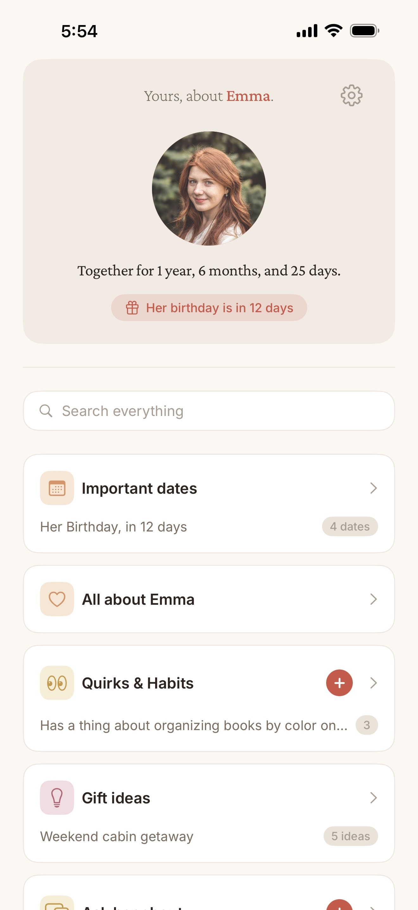
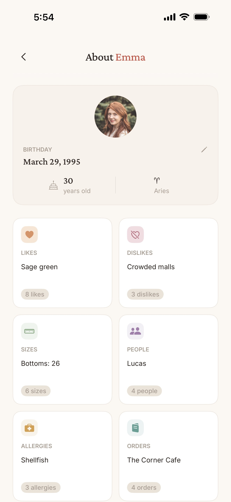
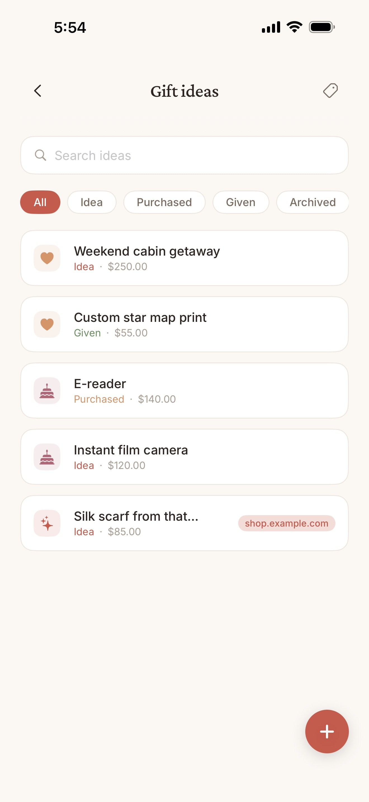
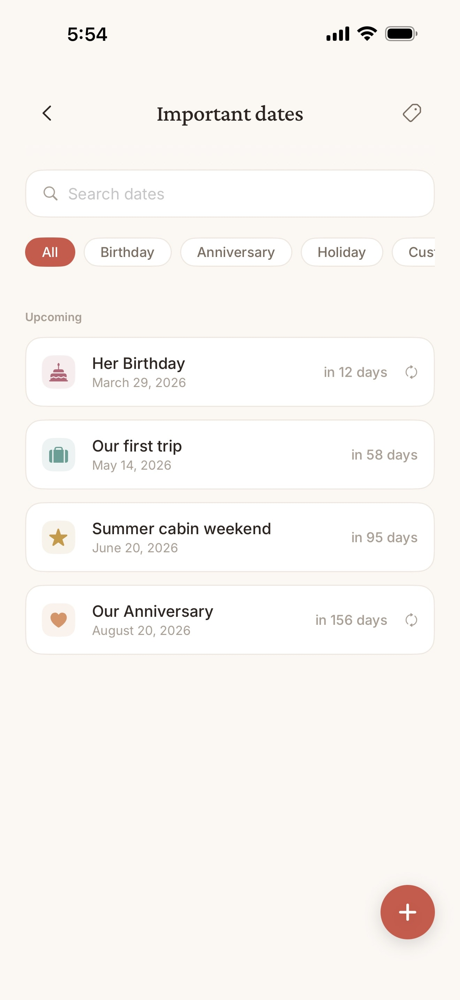
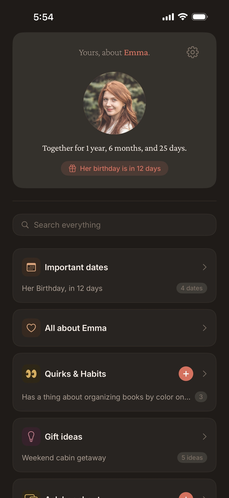

# Yours.

A native iOS app to remember everything about your partner. Sizes, allergies, food orders, gift ideas, important dates, and more. All synced with iCloud, zero dependencies.

  
  
  
  

  
  
  
  
  

## Features

- Track clothing sizes, allergies, food orders, likes and dislikes
- Save gift ideas with categories and status tracking
- Never miss a birthday, anniversary, or milestone with important dates and countdowns
- Add personal notes and quirks
- Search across all your saved details
- Home screen widgets and quick actions
- Export and import your data
- Sync across devices with iCloud
- Light and dark mode with theme customization
- Offline-first: no network required
- Fully native with zero third-party dependencies

## Requirements

- iOS 18.0+

## Building from Source

Open `yours.xcodeproj` in Xcode and build.

## License

Yours. is licensed under the [MIT License](LICENSE).
